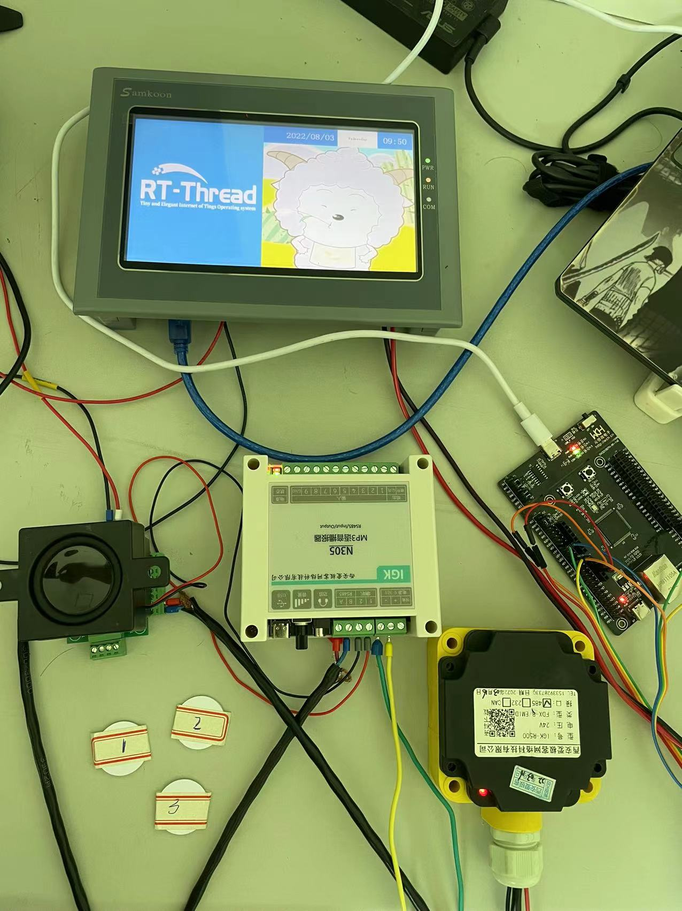

#                             rtt夏令营项目——打卡系统

##                                                                                                                                                                                                                                                                                                刘道鑫

### 项目简介：

####                   本项目为RTT夏令营的学习实践与成果展示，初步完成的同时还具有很多可以继续升级优化的空间，希望各位老师，大佬多多批评指正。

####                   本次项目为打卡系统，使用背景为在工作地点，办公场所等地的打卡签到系统，还可以外接门禁系统，实现“持卡刷卡进出登记“的效果，它主要包括RFID射频识别部分，MP3语音播报部分，屏幕显示部分以及数据云端传输部分组成；目前主要的设计目的是让工作人员持工卡在RFID识别器刷卡后，语音模块播报：“RTT提醒您 XXX已签到！”，同时屏幕上显示对应工作人员的人脸信息，最后将打卡时间，打卡人等信息传至云端，打卡系统就完成了它的功能。

### 项目完成情况：

####                     本项目实现了除连上云端外的所有功能，不能上云端的原因：在添加AT_DEVICE软件包之后，又添加了libmodbus软件包，但是此时就只能有一个串口进行modbus通信，导致项目无法正常实现功能，而去掉AT_DEVICE软件包后，modbus恢复正常，该项BUG个人能力有限，在限定时间内无法解决，非常抱歉。

**<u>已经购买其他WiFi模块，后续将继续完成并更新。</u>**

## RTT使用情况概述

 **本项目全程在RT-thread studio上搭建完成，主要用到串口通讯与LIBMODBUS软件包；因为硬件均采用RS485连接，因此将语音播报模块及图像显示模块放在了一路RS485上，并给他们设置不同的从站号以作区分；RFID识别模块放在另一路485上，用来识别磁卡信息。通讯协议采用modbus，因此RTT软件包中的libmodbus需要添加到项目中，这款软件包十分方便的解决了通讯协议的问题，提高了开发效率。另外，程序中还对学到的线程创建，内存的使用，邮箱的使用，main函数前执行程序的调用，设备对象的管理等知识进行了应用。**

## 整体系统框架

### 项目硬件：

硬件框架：

作品完整图片：

1)开发板

开发板为夏令营分组配置，这里不做过多介绍；

2）RFID射频识别器

这款识别器采用RS485通讯接口，通讯协议为MODBUS RTU，因此需要采用TTL转RS485模块将单片机串口电平转换为485电平，这里采用的转换模块为：

notes：这款转换模块已经能完成硬件的自动收发转换，因此不需要我们再对RS485的控制引脚做配置，直接忽略即可。

3）MP3语音播报模块

为方便开发，语音播报模块同样选用RS485搭配modbus通讯，使用的模块如下图：

4)屏幕显示模块

这款屏幕选择的是显控科技的HMI，功能强大，产品如下图：

我为本次项目设计的屏幕组件画面如下图：

5)云端连接

计划采用老师教的ESP8266进行云端连接，但是使用AT软件包后，我程序中就只能一个串口使用modbus；具体原因我也无法查出，所以上云暂时搁置。

### 项目软件：

#### 软件框架：

为提高程序的移植性，本次编程均未在main函数中编写，而是受到老师所讲课程的的启发，让程序在上电后，进入我们的main函数前就执行自己编写的程序，具体软件执行流程如图所示：

##### RFID：

##### screen_mp3:

### 成果视频：

视频在video文件夹内。

### 程序：

程序为：CH32文件。

### 感言：

            **与RTT夏令营的缘分来自于师兄的一次推荐，让我开始接触用RTT写一下小项目，用的不熟练，但在学习的过程中，我也在把他跟其他RTOS做对比，其实他在最开始最打动我的是他是我们国家自己的开源实时操作系统，是一个中国人自己的生态系统；而机缘巧合地，我被选进了这次RTT夏令营，深入地了解了物联网，RTOS，RTT内核，组件，软件包等等，我现在才意识到RTT的伟大之处，他不仅优秀，还具有非常好的包容性，RTT的老师也非常年轻，这次夏令营还让我看见了RTT的社会担当，他在为我们社会免费的，细致的，充满责任感的培养人才；我在这次夏令营中收获了非常多的知识，认识了很多的优秀的同龄人，非常非常感谢RTT给的这次机会，让我在成长的路上少走了不少弯路，同时学到的东西也可以帮助我完成我的硕士毕业论文，万分荣幸可在不远的将来把RTT放在我的致谢里！**
    
            **最后，我真诚的希望RTT能越来越好，希望中国的芯片行业，物联网行业，电子行业等等越来越好，希望中国越来越好！也祝愿我能够成为一名优秀的嵌入式工程师，为国家的建设增砖添瓦，希望我的生活越来越好!**
    
           **谢谢各位老师，同学！
